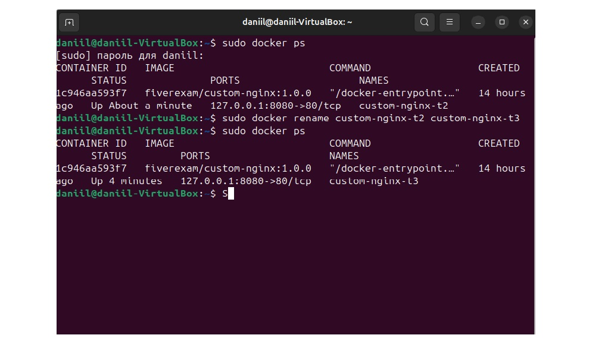
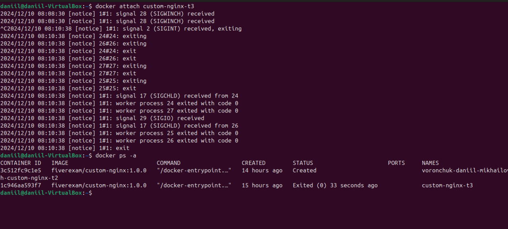
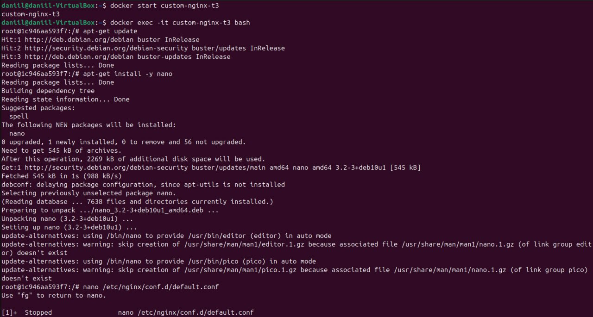
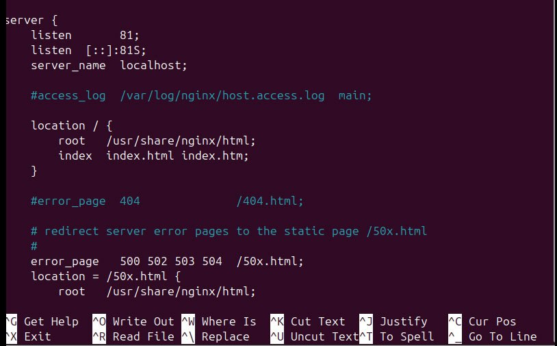
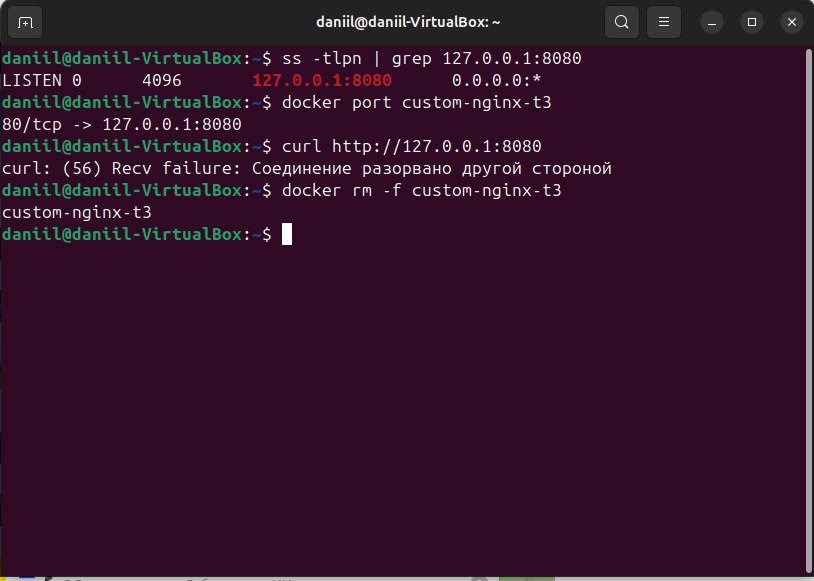

# Лаба 3

# Лабораторная работа №3: Работа с Docker

Автор: Ворончук Даниил

## Задание 1: 

- Ссылка на образ: [custom-nginx](https://hub.docker.com/repository/docker/fiverexam/custom-nginx/tags)

## Задание 2: 

- 

- 

## Задание 3:

-

-

-

-

